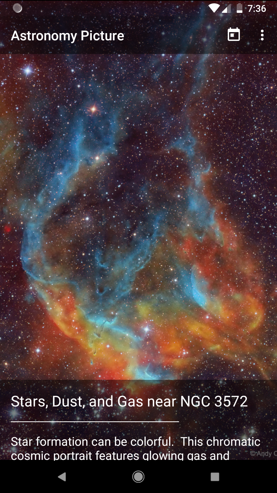
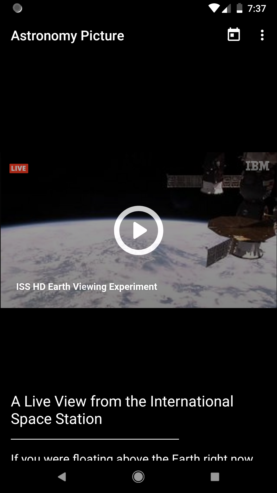
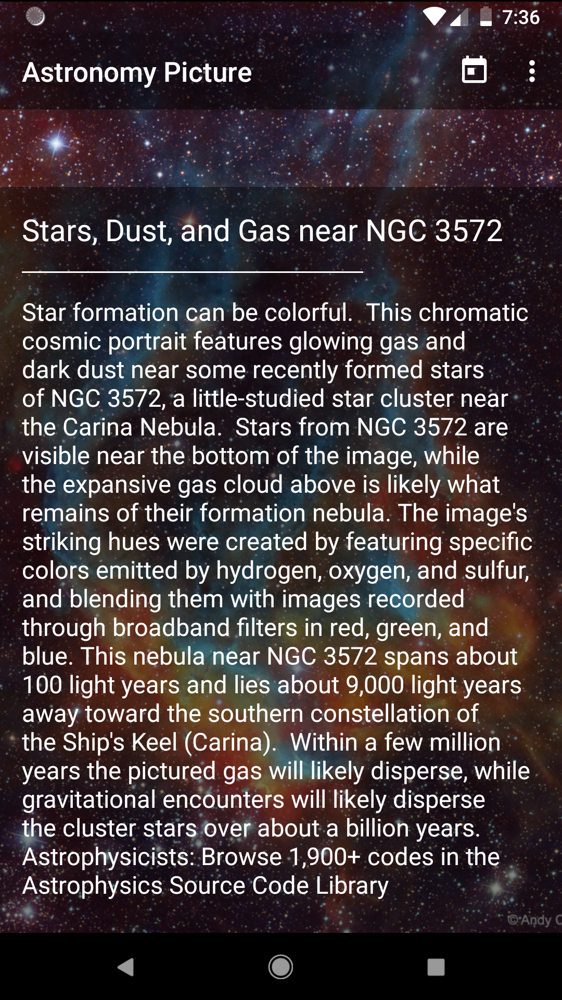
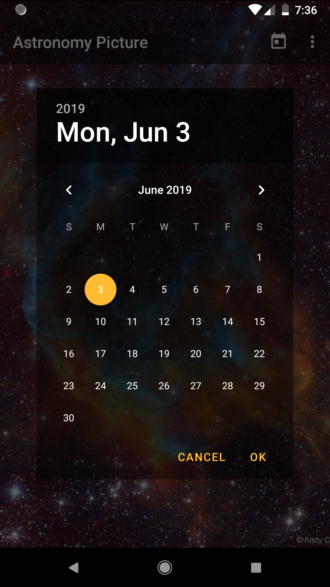
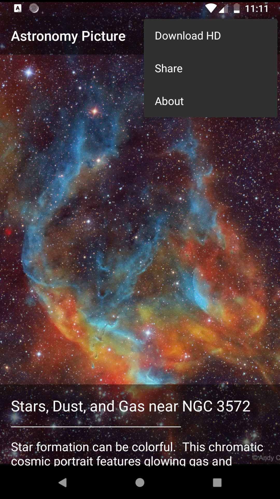

# 
نبذة عن المشروع

يعد علم الفلك والفضاء الخارجي من العلوم التي تستهوي الكثيرين حيث أن هناك الكثير من الناس ممن يحبون تعلم واستكشاف الجديد في هذا العلم.
كما لا يكاد يختلف شخصان على جمال وروعة تلك الصور الجذابة للكواكب والمجرات والنجوم والتي تدعونا إلى التفكر في بديع هذا الكون.

في هذا المشروع سوف نقوم ببناء تطبيق "صورة من الفضاء هذا اليوم" حيث يظهر هذا التطبيق صورة جديدة من الفضاء كل يوم يقوم فيه المستخدم بفتح التطبيق.

للقيام بهذا الأمر سوف نقوم بإستخدام Web APIs تقدمها وكالة الفضاء الدولية المعروفة بإسم NASA حيث توفر لنا هذه الـ APIs صورة جديدة كل يوم إضافة إلى وصف للصورة ومعلومات عنها، وبإمكاننا من خلالها الوصول إلى الصور التي تم نشرها في الماضي من خلال تحديد تاريخ اليوم.

يمكنك الإطلاع على المستند الخاص بالـ API وشرحها على موقع NASA من خلال زيارة الرابط التالي
<a href="https://api.nasa.gov">https://api.nasa.gov</a>

ملاحظة: يجب التسجيل في الموقع للحصول على الـ API Key الخاص بك حتى تتمكن من استخدام الـ APIs الخاصة بوكالة NASA

# 
واجهات المشروع

<h3>الشاشة الرئيسية - عرض صورة</h3>

<h3>الشاشة الرئيسية - عرض فيديو</h3>

<h3>الشاشة الرئيسية - عرض معلومات عن الصورة/الفيديو</h3>

<h3>تحديد التاريخ</h3>

<h3>قائمة الخيارات</h3>

